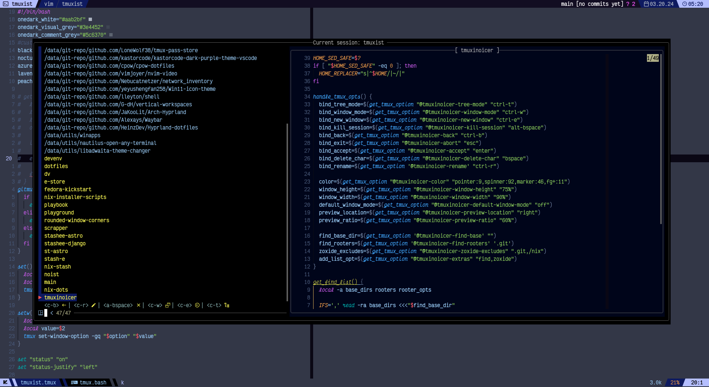

# tmuxinoicer

A combination of `noice` things to have in a tmux session manager.



## ✨ Features

- Integrations with fzf for fuzzy search
- Supports directory, session and tree-mode preview
- Integrations with find and zoxide for fast session creation base on directory

## 🛠️ Requirements

- find
- [tmux](https://github.com/tmux/tmux) (>= 3.2)
- [tpm](https://github.com/tmux-plugins/tpm)
- [zoxide](https://github.com/ajeetdsouza/zoxide)
- [fzf](https://github.com/junegunn/fzf) (>=0.35.0)
- Optional: [eza](https://github.com/eza-community/eza)

## 💻 Install

### Installation with [tpm](https://github.com/tmux-plugins/tpm)

Add the following line to your `.tmux.conf`.

```tmux
set -g @plugin 'percygt/tmuxinoicer'
```

### Installation via [nix](https://github.com/NixOS/nix) `overlay`

Add tmuxinoicer as a flake input:

```nix
{
  inputs = {
    tmuxinoicer.url = "github:percygt/tmuxinoicer";
  };
  outputs = { tmuxinoicer, ... }: { };
}
```

Then, use the flake's `overlay` attribute:

```nix
{
  outputs = { tmuxinoicer, nixpkgs, ... }:
  let
    pkgs = import nixpkgs {
      system = "x86_64-linux";
      overlays = [ tmuxinoicer.overlays.default ];
    };
  in
    # You can now reference pkgs.tmuxPlugins.tmuxinoicer.
  { }
}
```

After that, `tmuxinoicer` can now be used as a normal tmux plugin within
`nixpkgs`.

## ⚙️ Customization

| Variable                           | Default value   | Description                                                                                      |
| :--------------------------------- | :-------------- | :----------------------------------------------------------------------------------------------- |
| `@tmuxinoicer-bind`                | `"o"`           | `Prefix` then this key to trigger the plugin.                                                    |
| `@tmuxinoicer-window-mode`         | `"ctrl-w"`      | Key to display a list of windows for every session.                                              |
| `@tmuxinoicer-tree-mode`           | `"ctrl-t"`      | Key to display the tree-mode preview.                                                            |
| `@tmuxinoicer-new-window`          | `"ctrl-e"`      | Key to display a list of directories in the current session.                                     |
| `@tmuxinoicer-kill-session`        | `"alt-bspace"`  | Key to kill the session.                                                                         |
| `@tmuxinoicer-rename`              | `"ctrl-r"`      | Key to rename either the session or the basename of a directory.                                 |
| `@tmuxinoicer-back`                | `"ctrl-b"`      | Key to move back.                                                                                |
| `@tmuxinoicer-window-height`       | `"75%"`         | Fzf-tmux display height.                                                                         |
| `@tmuxinoicer-window-width`        | `"90%"`         | Fzf-tmux display width.                                                                          |
| `@tmuxinoicer-default-window-mode` | `"off"`         | Sets window-mode as the default result display for sessions.                                     |
| `@tmuxinoicer-preview-location`    | `"right"`       | Fzf-tmux preview location.                                                                       |
| `@tmuxinoicer-preview-ratio`       | `"60%"`         | Fzf-tmux preview ratio.                                                                          |
| `@tmuxinoicer-extras`              | `"find,zoxide"` | Adds both find and zoxide to the result list.                                                    |
| `@tmuxinoicer-find-base`           | `""`            | Comma-separated list of directories and their depths for searching directories based on rooters. |
| `@tmuxinoicer-find-rooters`        | `".git"`        | Comma-separated list of rooters.                                                                 |
| `@tmuxinoicer-zoxide-excludes`     | `".git,/nix"`   | Comma-separated list of paths you don't want in the zoxide result.                               |

### Guide

You can modify the list of default values above by setting the desired values in
your `.tmux.conf`.

```tmux
set -g <variable> <value>
```

#### `@tmuxinoicer-extras`

`find` and `zoxide` are both enabled by default. If you want to display only
`find` result.

```tmux
set -g @tmuxinoicer-extras "find"
```

#### `@tmuxinoicer-find-rooter`

The result of `find` is based on the value of `@tmuxinoicer-find-rooter`. If the
value is `.git`, it will search for directories that has `.git` directory in it.
If you want the result to display all directories set this:

```tmux
set -g @tmuxinoicer-find-rooters ""
```

#### `@tmuxinoicer-find-base`

`@tmuxinoicer-find-base` is a comma-separated list of directories and their
depths to search for directories based on rooters.

Each element of the list is in the following format:

```bash
/path/to/dir[:<min depth>[:<max depth>]]
```

- If you omit `<min depth>` and `<max depth>`, they are set to `0` and `0`
  respectively.
- If you omit `<max depth>`, it is set to `<min depth>`. (means `<min depth>` is
  the exact depth)

If you omit the depth or explicitly set it to `0`, the directory itself will be
added as a project. In that case, you can add the directory as an input even if
it contains no rooter.

---

For example, if you want to search for [ghq](https://github.com/x-motemen/ghq)
repositories as an input:

```tmux
set -ag @tmuxinoicer-find-base ,"$(ghq root):3"
```

For example, if you want to add `~/.config/nvim` itself as an input:

```tmux
set -ag @tmuxinoicer-find-base ,"${HOME}/.config/nvim"
```

## Thanks ❤️

Kudos to those behind these projects below. I wanted a session manager that fits
my workflow, so I extracted key features and `noice` things from these sources:

- https://github.com/sei40kr/tmux-project
- https://github.com/omerxx/tmux-sessionx
- https://github.com/joshmedeski/t-smart-tmux-session-manager
- https://github.com/ThePrimeagen/.dotfiles/blob/master/bin/.local/scripts/tmux-sessionizer

## License

MIT
